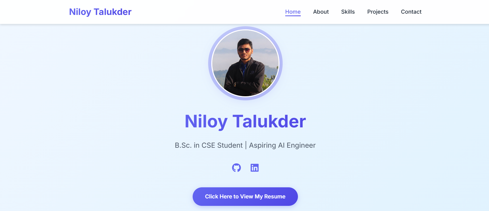
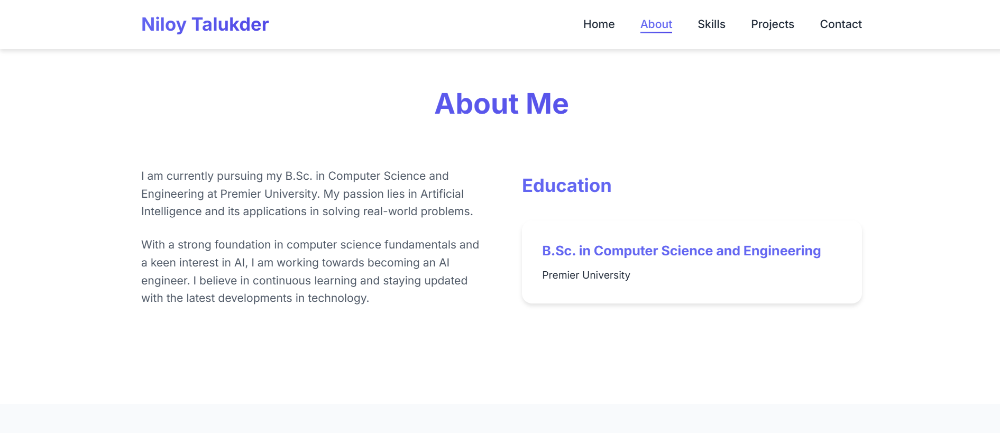
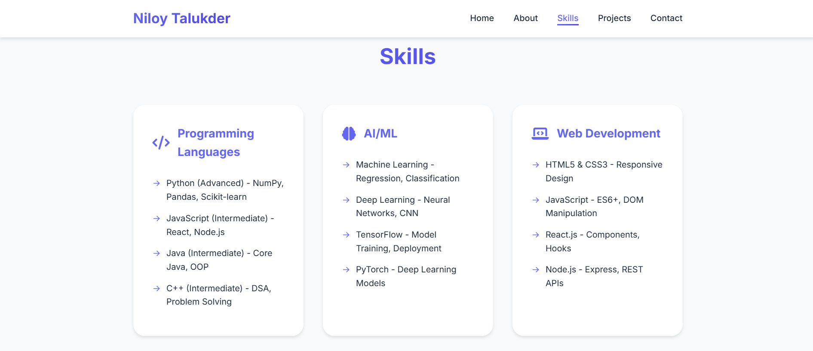
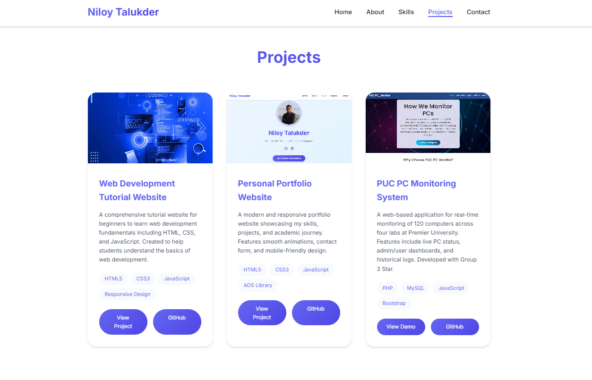
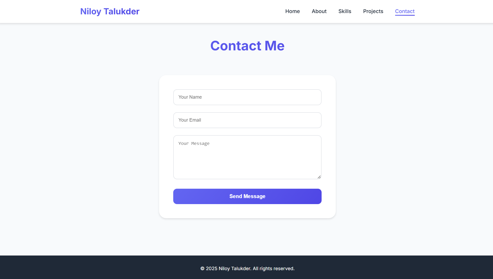

# 🌐 Niloy Talukder – Personal Portfolio Website


> A responsive and modern personal portfolio website showcasing skills, projects, academic journey, and a contact form.

---

## 🚀 Live Demo

👉 [Live Portfolio](https://niloytalukdar.github.io/myportfolio/)

---

## 🖼️ Screenshots

### 🔹 Home Section


### 🔹 About Section


### 🔹 Skills Section


### 🔹 Projects Section


### 🔹 Contact Section


---

## ✨ Features

- 📖 About Me and Education
- 🛠️ Skills across Programming, AI/ML, and Web Development
- 🧩 Projects with live demo and GitHub links
- 📬 Contact form integrated with EmailJS
- 📱 Fully responsive for mobile and desktop
- 🎨 Smooth animations with AOS.js
- 🖌️ FontAwesome Icons and modern typography

---

## 🛠️ Built With

- **HTML5** – Structure
- **CSS3** – Styling and responsive design
- **JavaScript (Vanilla)** – Interactivity
- **AOS (Animate On Scroll)** – Animations
- **EmailJS** – Contact form backend
- **Font Awesome** – Icons
- **Google Fonts** – Fonts styling

---

## 📂 Folder Structure

```
portfolio/
├── index.html
├── styles.css
├── script.js
├── profile.jpg
├── WebDev.webp
├── pp.png
├── pcms.png
├── images/
│   ├── screenshot_home.png
│   ├── screenshot_about.png
│   ├── screenshot_skills.png
│   ├── screenshot_projects.png
│   ├── screenshot_contact.png
```

---

## 📦 Getting Started

### ✅ Prerequisites
- Browser (Chrome, Firefox, Edge)
- Code Editor (VS Code recommended)


### 🌍 Deployment

Deploy using:
- GitHub Pages
- Netlify
- Vercel
- Firebase Hosting

---

## 📜 License

This project is licensed under the [MIT License](LICENSE) — see the LICENSE file for more details.

---

## 📬 Contact

- 📧 Email: [your-email@example.com](mailto:your-email@example.com)
- 🔗 LinkedIn: [https://linkedin.com/in/yourprofile](https://linkedin.com/in/yourprofile)
- 🌐 Website: [https://niloytalukdar.github.io/myportfolio/](https://niloytalukdar.github.io/myportfolio/)

---
